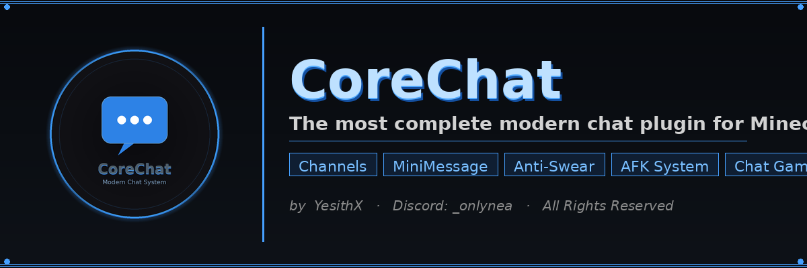

<div align="center">

# CoreChat

**The most complete modern chat plugin for Minecraft.**
Channels · MiniMessage · Anti-Swear · AFK System · Chat Games · Fully Configurable

[](https://github.com/YesithTK/CoreChat)
[](https://papermc.io)
[](https://adoptium.net)
[](#license)

</div>

---

## Overview

CoreChat is a full chat management system built from scratch for modern Paper servers. It replaces basic chat plugins with a single, powerful solution covering channels, formatting, moderation, private messages, AFK detection, mini-games and more — all in one plugin, all configurable.

Every format string in CoreChat supports `%placeholder%` syntax and resolves through **PlaceholderAPI**, meaning any placeholder from any installed plugin works out of the box — SimpleClans, statistics, economy, AFK status, and anything else.

---

## Features

### Chat Channels
- Global, Local, Staff, Trade, Admin and Help channels — fully configurable
- Range-based local chat (distance in blocks)
- Per-channel permission, prefix, format, color and cooldown override
- Switch channels on the fly with `/channel`

### Formatting
- Full **MiniMessage** support (gradients, rainbow, colors, decorations)
- Legacy `&` color code support
- Per-tag blocking — disable specific MiniMessage tags like `click`, `hover`, `font`
- Permission-gated formatting (`corechat.minimessage`, `corechat.legacy`)
- Full **PlaceholderAPI** integration in every format string

### Moderation
- Anti-swear filter — word list + regex patterns, fully customizable
- Configurable action: replace, block, or warn-then-mute
- Anti-caps — max percentage threshold, replace or block
- Anti-flood — message similarity detection
- Anti-spam — rate limiting with auto-mute
- Anti-advertising — IP/domain detection with whitelist support
- Individual and global mute, with duration and reason
- Persistent mute storage across restarts

### Communication
- Private messages (`/msg`, `/r`) with SocialSpy
- Staff chat toggle
- Server-wide broadcast with sound and title support
- Player mentions (`@username`) with sound notification
- Ignore system — block chat and/or private messages per player

### Quality of Life
- AFK detection with auto-kick option
- Custom join/quit messages with first-join detection
- Chat log to file (chat, private messages, blocked messages)
- Built-in chat mini-games — math and word unscramble with money rewards
- LuckPerms and Vault integration for prefixes/suffixes

### Fully Configurable
- 350+ lines of configuration covering every feature above
- Two complete language files — Spanish and English
- Every message, format, sound and threshold is editable

---

## Requirements

| Dependency | Required | Purpose |
| --- | --- | --- |
| Paper / Spigot 1.20.x — 1.21.x | Yes | Server platform |
| Java 21 | Yes | Runtime |
| [PlaceholderAPI](https://www.spigotmc.org/resources/placeholderapi.6245/) | Recommended | Resolves all `%placeholder%` variables |
| [Vault](https://www.spigotmc.org/resources/vault.34315/) | Optional | Money rewards for chat games |
| [LuckPerms](https://luckperms.net/) | Optional | Automatic prefixes and suffixes |

---

## Installation

1. Place `CoreChat.jar` in your `/plugins` folder.
2. (Recommended) Install PlaceholderAPI for full placeholder support.
3. Start the server once to generate the config and language files.
4. Edit `plugins/CoreChat/config.yml` to your liking.
5. Run `/cc reload`.

---

## Commands

| Command | Description | Permission |
| --- | --- | --- |
| `/cc reload` | Reload configuration | `corechat.admin` |
| `/cc info` | Show plugin info | `corechat.admin` |
| `/msg <player> <message>` | Send a private message | `corechat.msg` |
| `/r <message>` | Reply to last message | `corechat.msg` |
| `/bc <message>` | Broadcast a message | `corechat.broadcast` |
| `/mute <player> [seconds] [reason]` | Mute a player | `corechat.mute` |
| `/unmute <player>` | Unmute a player | `corechat.mute` |
| `/mutechat` | Toggle global chat mute | `corechat.mutechat` |
| `/clearchat` | Clear the chat | `corechat.clearchat` |
| `/channel <name>` | Switch chat channel | `corechat.channel` |
| `/socialspy` | Toggle private message spying | `corechat.socialspy` |
| `/staffchat` | Toggle staff chat | `corechat.staffchat` |
| `/ignore <player>` | Ignore/unignore a player | `corechat.ignore` |

---

## Configuration Preview

```yaml
chat:
  format: "%luckperms_prefix%%player%%luckperms_suffix% &8» &f%message%"

filter:
  enabled: true
  action: "replace"
  warn-threshold: 3
  mute-on-threshold: true
  mute-duration-seconds: 300

afk:
  enabled: true
  timeout-seconds: 300
  broadcast-on-afk: true

chat-games:
  math:
    enabled: false
    reward-money: 100.0
```

The full configuration file covers channels, private messages, broadcasts, cooldowns, anti-caps, anti-flood, anti-spam, anti-advertising, mute system, mentions, staff chat, AFK, chat games, logging, and join/quit messages.

---

## License

© 2026 YesithX — All Rights Reserved.

This plugin is provided free of charge for personal and server use. You may **not** copy, modify, decompile, resell, or redistribute this plugin or any part of its source code without explicit written permission from the author.

---

## Support

- **Discord:** `_onlynea`
- **Issues:** [github.com/YesithTK/CoreChat/issues](https://github.com/YesithTK/CoreChat/issues)

---

*CoreChat — by YesithX · Free to use · All Rights Reserved*
